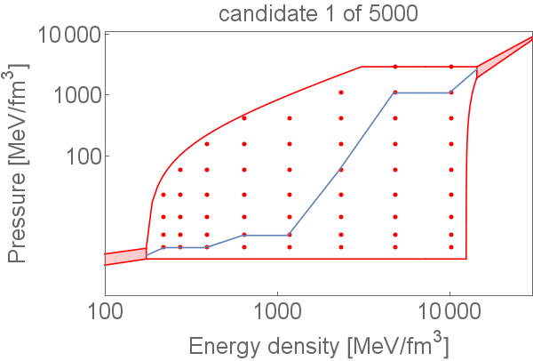

# Neutron Matter Equation of State   
[A. Windisch](https://www.linkedin.com/in/andreas-windisch-physics/), Jan. 2019   
      
### 0 Synopsis   
         
This repository provides the code used in the publication [Eva Lope Oter, Andreas Windisch, Felipe J. Llanes-Estrada and Mark Alford, nEoS: Neutron Star Equation of State from hadron physics alone, arXiv:1901.05271 (gr-qc)](https://arxiv.org/abs/1901.05271). For sample sets generated with this code, also see the [project website](http://teorica.fis.ucm.es/nEoS/). This repository contains the code for genereating sets of Equations of States (EoS) at neutron star densities, where the EoSs are constrained by hadron physics, monotony and causality, but not by General Relativity. Sets generated with this code can thus be used to test modified gravity theories.  
Feel free to use and modife the code as you please. If you have questions, contact me via LinkedIn using the link above, or write me an email using [andreas.windisch@yahoo.com](andreas.windisch@yahoo.com).   
Here is an animation that shows some random EoS candidates.   
   
   

   
### 1 Files in this repository
   
- README.md - this file   
- generate_EoS.f90 - the main source file with instructions and comments, written in FORTRAN
- aux.f90 - contains various functions and subroutines used in the main code
- some_EoS_candidates.gif - An animation that shows several EoS candidates generated by the code

### 2 Usage
   
Just download the code, compile using e.g. gfortran, and run the executable. No liability assumed under any circumstance.  

